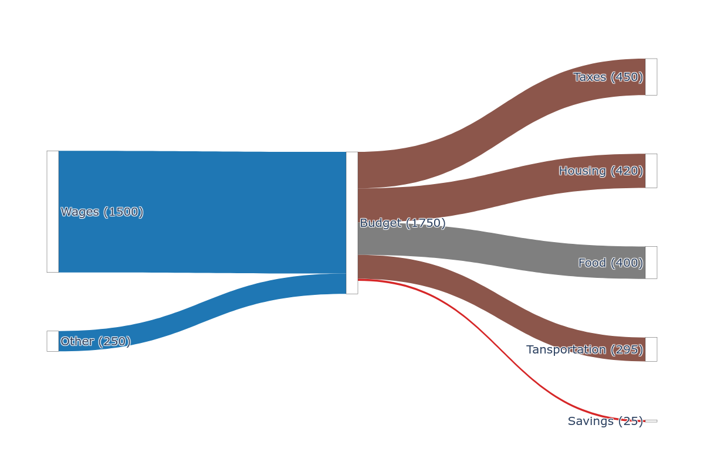

# Pysankey

## Install:

```sh
pip install git+https://github.com/LeSasse/pysankey.git
```

Test that it is installed properly:

```sh
pysankey --help
```

## Usage

A simple script may look like:

```

Wages [1500] Budget
Other [250] Budget

Budget [450] Taxes
Budget [420] Housing
Budget [400] Food
Budget [295] Transportation
Budget [25] Savings
```

Save it in `budget.txt` and run:
```sh
pysankey budget.txt --show
```

This will open the sankey chart in plotly in your browser for manual editing.
You can also save the output in a supported file format ['png', 'jpg', 'jpeg', 'webp', 'svg', 'pdf', 'eps', 'json'] as follows:

```sh
pysankey budget.txt -o budget.png
```

The result will look something like this:



Add colors to the nodes using parentheses and to flows by using curly braces
as follows:
```

Wages(color: black) [1500] Budget(color: red){color: rgba(255,0,0,0.2)}
Other [250] Budget

Budget [450] Taxes
Budget [420] Housing
Budget [400] Food
Budget [295] Tansportation
Budget [25] Savings
```

If colors are not specified flow colors will be chosen at random and nodes will default to white. You can use css named colors or rgba values as shown above.
The result will look something like this:


